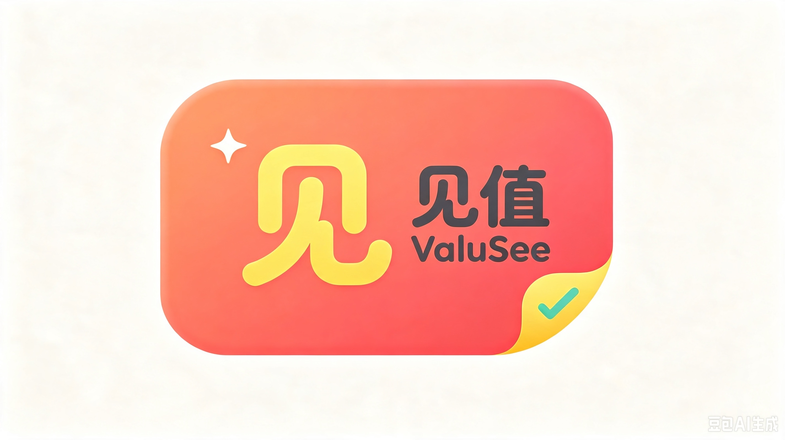
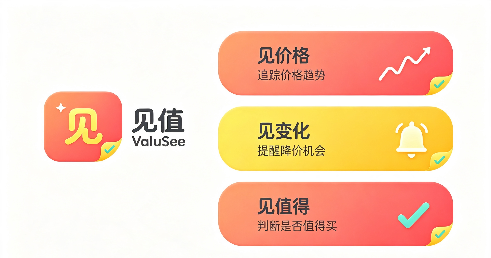
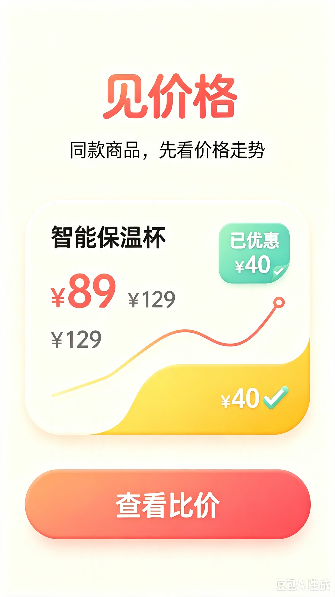
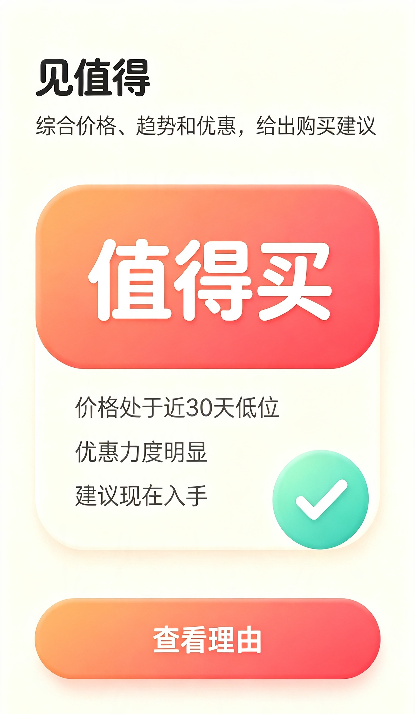

<div align="center">
  

  # ValuSee 见值

  **买之前，先看清价值。**

  把商品链接、截图或购买需求交给 AI，分清是不是同款，算清真实到手价，判断适不适合你，并持续跟进降价、保价和售后期限。

  [在线体验](https://valusee.com) · [功能记录](docs/VALUSee_IMPLEMENTATION_LOG.md) · [生产部署](docs/VALUSee_PRODUCTION_RELEASE.md) · [浏览器扩展](extension/README.md)

  [](LICENSE)
  [](pyproject.toml)
  [](web/package.json)
  [](pyproject.toml)
</div>

---

[中文](#valuesee-见值) | [English](#valuesee-english-version)

ValuSee 不是另一个只把商品按标价排序的比价器。它面向一次真实购买中最麻烦的那些问题：相似标题背后是不是同一个 SKU，优惠叠加后究竟要付多少钱，最低价是否暗藏版本和售后风险，以及这个商品是否真的适合当前用户。

用户可以从一个模糊需求开始，也可以直接提交多个候选商品：

```text
购买需求 / 商品链接 / 商品截图 / 浏览器采集
  -> 商品识别与人工确认
  -> SKU 与规格匹配
  -> 真实到手价计算
  -> 评论证据与风险分析
  -> 个性化购买建议
  -> 目标价格监控
  -> 保价、退货与保修管理
```

ValuSee 的目标不是替用户冲动下单，而是把一次购买需要核对的事实放到同一个地方，并让每一条价格、规格和结论都能回到来源。



## 为什么需要 ValuSee

传统比价产品通常擅长回答“哪里标价更低”，但一次购买往往卡在更细的地方：

- 同一个商品在不同平台的标题、型号和套装名称完全不同。
- 容量、接口、代次、地区版本或成色不同，却容易被误认为同款。
- 店铺券、平台满减、会员价、补贴、支付优惠、运费和赠品价值难以一起核算。
- 最低价可能来自拆封、翻新、海外版、非官方店铺或限制退货的商品。
- 用户已有设备、预算和使用场景不同，统一推荐并不可靠。
- 下单后仍可能降价，保价、退货、发票和保修期限容易被忘记。

因此，ValuSee 比较的不是一个孤立数字，而是“对当前用户而言，哪一个候选是更低风险、更适配的真实低成本方案”。

## 一次完整的购物决策

你可以粘贴多个淘宝、天猫、京东或拼多多商品链接，上传商品截图，输入型号，也可以直接描述“想买一台适合 MacBook 一线连接的 27 英寸显示器”。

ValuSee 会先把标题、品牌、标准型号、当前 SKU、版本、成色、店铺和售后条款整理成可编辑候选。识别结果不会直接变成可信事实，用户确认后才进入比较。

### 1. 分清是不是同款

SKU 匹配不只比较标题相似度。系统会核对品牌、标准型号、代次、容量、颜色、接口、地区版本、套装内容、新旧状态和保修方式，并明确标记：

- 完全同款
- 不同配置
- 不同代次
- 不同套装
- 不同地区版本
- 新品、拆封、翻新或二手
- 证据不足，需要确认

这一步用于避免把 AirPods Pro 2 USB-C、Lightning 版本、旧代产品或翻新版混在同一价格排序中。

### 2. 算清真实到手价

ValuSee 保留每项优惠条件并展示完整算式：

```text
页面价格
- 店铺优惠券
- 平台满减
- 会员优惠
- 消费补贴
- 支付优惠
- 换新补贴
+ 运费
- 可量化赠品价值
= 预计真实到手价
```

价格记录同时保存来源链接、采集时间、地区、会员条件、选中 SKU 和确认状态。无法确认的优惠不会伪装成无条件低价。

### 3. 判断是否值得买

购物工作流由 Intent、Product、SKU Matching、Price、Review、Risk、Recommendation、Supervisor 和 Reporter 等角色协作完成。价格计算和关键风险规则由确定性事实层复核，避免让语言模型自行计算金额或臆测商品风险。

最终报告覆盖：

- 候选商品的规格差异和到手价排序
- 价格、规格、店铺与售后风险
- 可追溯评论中的高频问题与证据
- 与用户预算、设备和偏好的匹配程度
- 当前购买或继续等待的建议及不确定性
- 推荐与不推荐的具体原因

### 4. 从等待降价到买后管理

用户可以为指定 SKU 设置目标价、期限、平台和通知频率。监控任务持久化保存，支持暂停、恢复和失败重试；公开页面无法验证登录价或个性化优惠时，系统会要求用户重新通过扩展确认，而不是把不可靠价格写入历史。

购买后可以继续记录实付金额、收货日期、发票、保价期限、退货期限、保修期限、会员续费和耗材周期。站内消息会提示降价机会和临近截止日期，外部邮件或 Push 则按部署配置发送。

## 核心功能总览

| 模块 | 能力 |
| --- | --- |
| 首页发现 | 搜索与自然语言需求入口、品类入口、历史低价与降价内容、选购指南和可信数据空状态 |
| 智能对比 | 多候选录入、规格编辑、SKU 匹配、优惠拆解、差异高亮、排序、保存与分享 |
| 截图识别 | 浏览器端中英文 OCR、可选视觉模型结构化识别、低置信度提示和人工确认 |
| 商品详情 | 稳定详情视图、价格趋势、来源报价、规格版本、评论证据、风险与替代项 |
| 个性化建议 | 预算、用途、已有设备、品牌偏好、重量/续航等偏好和历史退货原因 |
| 省钱中心 | 目标价格监控、监控状态、降价提醒、价格记录和累计节省结果 |
| 收藏与足迹 | 收藏分组、搜索、批量管理、浏览历史、最近对比和关注品牌 |
| 我的购买 | 订单、发票和附件、保价、退货、保修、耗材与续费期限管理 |
| 消息中心 | 降价、保价、售后和系统消息，支持分类、已读状态与页面跳转 |
| 家庭与账户 | 个人资料、设备档案、家庭协作、会话安全、MFA、数据导出与账号删除 |
| 用户 LLM | 用户可配置自己的 OpenAI 兼容文本/视觉服务；密钥加密保存，平台配置仅作回退 |
| 管理后台 | 用户与商品治理、标准商品/SKU、内容、来源状态、Prompt、Trace、成本、Benchmark 和监控任务 |
| Web / PWA | 响应式消费者界面、移动端底部导航、可安装 PWA、公开离线壳与错误恢复 |

## 浏览器扩展

ValuSee 提供 Manifest V3 扩展。在用户打开淘宝、天猫、京东或拼多多商品详情页后，扩展只读取当前页面中用户已经能够看到的信息：

- 商品标题、图片和来源链接
- 当前选择的 SKU 与规格
- 页面价格、会员价、优惠券和满减
- 店铺名称、地区和会员条件
- 采集时间与页面证据

采集结果会先在扩展内编辑确认，再发送到 ValuSee 的待确认箱；用户在 Web 端进行第二次确认后，记录才会进入可信价格历史。

扩展不遍历平台搜索结果，不绕过登录、验证码或访问控制，也不在后台进行大规模爬取。安装与连接方法见 [extension/README.md](extension/README.md)。

## 真实数据边界

ValuSee 不生成虚假商品、价格、评论或优惠资格。

在没有电商平台正式授权时，产品使用以下数据路径：

1. 解析用户主动提交的公开商品链接。
2. 页面要求登录、验证码或动态渲染时，提示使用浏览器扩展。
3. 使用截图 OCR 或视觉模型提取页面可见信息。
4. 允许用户手动补充价格和优惠条件。
5. 保存来源、时间、SKU、地区、会员条件和用户确认状态。

全平台商品搜索、联盟推广链接和稳定的个性化实时价格需要正式平台 API 或联盟授权。未配置授权的数据源会保持空结果，而不是用演示商品填充。

## 多 Agent 与事实校验

ValuSee 将购物决策拆分为可观察、可恢复的工作流：

```text
created
  -> collecting
  -> matching
  -> comparing
  -> waiting_confirmation
  -> monitoring
  -> price_reached
  -> purchased
  -> after_sales
  -> completed
```

| 角色 | 职责 |
| --- | --- |
| Intent Agent | 解析预算、用途、限制条件和优先级 |
| Product Agent | 将标题、截图和页面字段标准化为商品信息 |
| SKU Matching Agent | 判断候选是否为真正同款并解释差异 |
| Price Agent | 整理优惠条件，调用确定性价格计算器 |
| Review Agent | 仅基于有来源评论归纳常见问题 |
| Risk Agent | 分析规格、店铺、价格和售后风险 |
| Recommendation Agent | 结合用户档案判断适配度与替代方案 |
| Supervisor | 检查缺失来源、矛盾事实和越界结论 |
| Monitor / After-sales | 执行长期价格监控和买后期限管理 |
| Reporter | 生成结构化、可保存和可分享的决策报告 |

工作流支持 checkpoint/resume、幂等重试、人工确认和调用 Trace。LLM 负责理解、归纳与解释；金额、时间和硬约束由代码规则验证。

## 产品预览

| 见价格 | 见变化 | 见值得 |
| --- | --- | --- |
|  |  |  |

## 技术架构

```text
React / TypeScript / Vite / PWA
              |
              v
        FastAPI API
 auth | shopping | reports | admin | uploads
              |
              v
 LangGraph shopping workflow + deterministic fact validators
              |
      +-------+--------+----------------+
      |                |                |
 PostgreSQL         Redis          RabbitMQ
 durable data    cache/rate limit  task events
      |                                 |
      +---------- monitor worker -------+
              |
        S3 / Cloudflare R2
       private user attachments
```

主要技术栈：

- React 18、TypeScript、Vite 6、Lucide、Tesseract.js
- Python 3.11+、FastAPI、Pydantic、LangGraph、LangChain
- PostgreSQL、Redis、RabbitMQ、S3 兼容对象存储
- Playwright、Pytest、Ruff、Docker Compose
- Vercel Web、Cloudflare、可独立运行的周期监控 Worker

## 快速开始

### 环境要求

- Python 3.11+
- Node.js 20+
- npm

### 1. 安装后端

```bash
git clone https://github.com/biheto/ValuSee.git
cd ValuSee
python -m venv .venv
```

Windows：

```powershell
.\.venv\Scripts\Activate.ps1
pip install -e ".[dev]"
Copy-Item .env.example .env
```

macOS / Linux：

```bash
source .venv/bin/activate
pip install -e ".[dev]"
cp .env.example .env
```

### 2. 构建前端并启动一体化服务

```bash
cd web
npm install
npm run build
cd ..
python -m uvicorn app.main:app --reload --port 8100
```

打开 [http://127.0.0.1:8100](http://127.0.0.1:8100)。FastAPI 会同时提供 API 与构建后的消费者页面。

Windows 也可以直接运行：

```powershell
.\setup-and-start.ps1
```

### 3. 前端开发模式

先在一个终端启动后端，再在另一个终端运行：

```bash
cd web
npm run dev
```

打开 [http://127.0.0.1:5173](http://127.0.0.1:5173)。Vite 会将本地 `/api` 请求代理到后端。

## 环境变量

复制 `.env.example` 用于本地开发；生产环境从 `.env.production.example` 创建私有配置。不要提交任何真实密钥。

最小 LLM 配置：

```env
OPENAI_API_KEY=your_api_key
OPENAI_BASE_URL=https://api.openai.com/v1
DEV_AGENT_LLM_MODEL=your_text_model
VALUSee_VISION_MODEL=your_vision_model
```

核心生产配置：

```env
APP_ENV=production
VALUSee_JWT_SECRET=generate_a_long_random_secret
VALUSee_MFA_ENCRYPTION_KEY=generate_a_fernet_key
VALUSee_METRICS_TOKEN=generate_a_long_random_token
VALUSee_ADMIN_EMAILS=admin@example.com
VALUSee_PUBLIC_BASE_URL=https://valusee.com

DATABASE_URL=postgresql://...
REDIS_URL=redis://...
RABBITMQ_URL=amqp://...
S3_ENDPOINT_URL=https://...
S3_BUCKET=valuesee-uploads
S3_ACCESS_KEY=...
S3_SECRET_KEY=...
```

用户也可以在“我的 -> 我的 LLM 配置”中保存自己的 OpenAI 兼容服务。用户密钥使用应用加密密钥加密存储，接口只返回脱敏尾号；系统会拦截指向本机和内网的 Base URL。

完整变量、Cloudflare R2、Vercel、周期任务、备份恢复和安全检查见 [生产发布文档](docs/VALUSee_PRODUCTION_RELEASE.md)。

## Docker 生产部署

```bash
cp .env.production.example .env.production
docker compose --env-file .env.production -f docker-compose.production.yml up -d --build
```

生产拓扑包括 API、监控 Worker、PostgreSQL、Redis、RabbitMQ 和私有对象存储。只应向公网暴露反向代理的 80/443 端口；数据库、缓存、消息队列和对象存储端口必须保持私有。

上线前至少检查：

```text
/health
/ready
注册、登录、邮箱验证与密码重置
截图上传与商品确认
多候选对比与报告保存
价格监控和消息通知
附件上传、下载与删除
管理员 MFA 与权限隔离
容器重启后的任务和数据恢复
```

## 测试与质量检查

后端测试：

```bash
pytest
ruff check app tests
```

前端构建与端到端测试：

```bash
cd web
npm run build
npm run test:e2e
npm run test:collector
```

测试重点覆盖账号与权限、商品标准化、多候选 SKU 匹配、价格计算、购物工作流、截图 OCR、浏览器采集、报告、价格监控、购买状态和消费者页面导航。

## 隐私与安全

- 用户数据从认证令牌确定归属，不能通过请求体跨账户访问。
- 密码使用带独立盐值的 PBKDF2-HMAC-SHA256；管理员支持 TOTP MFA 和恢复码。
- 上传文件经过类型、大小、摘要和随机文件名校验，并通过鉴权 API 访问私有对象。
- 生产环境校验 HTTPS、允许域名、跨域来源和高强度密钥。
- 支持账户数据导出与删除，覆盖报告、收藏、监控、购买和附件记录。
- 对外通知和周期任务使用签名、时间窗口和幂等处理。
- 商品结论保留来源与置信度；证据不足时要求人工确认。

## 项目定位

ValuSee 首期聚焦手机、笔记本、显示器、耳机、键盘、路由器、扫地机器人和咖啡机等数码产品与小家电。这些品类型号相对标准、决策成本高、兼容性问题明确，也更适合建立可评测的 SKU 与价格数据。

ValuSee 不自动下单、支付、退款或替用户执行未经确认的外部操作，也不把大规模后台爬虫作为核心数据来源。它提供的是一套可解释的消费决策和买后管理流程，最终决定始终由用户作出。

## 路线与贡献

当前版本已经包含消费者 Web、PWA、浏览器扩展、购物多 Agent、价格监控、买后管理、账户安全与运营后台。平台正式 API、联盟跳转和更大规模的历史价格覆盖取决于对应授权与持续积累的可追溯数据。

功能实现记录见 [VALUSee_IMPLEMENTATION_LOG.md](docs/VALUSee_IMPLEMENTATION_LOG.md)，生产验收与外部服务清单见 [VALUSee_PRODUCTION_RELEASE.md](docs/VALUSee_PRODUCTION_RELEASE.md)。Issue 与 Pull Request 均欢迎围绕数据适配、品类规则、可访问性、安全和测试质量提交。

## License

This project is licensed under the [MIT License](LICENSE).

---

# ValuSee English Version

**See the value before you buy.**

ValuSee is an AI shopping decision and savings assistant. Give it product links, screenshots, or a buying need, and it helps determine whether candidates are truly the same SKU, calculate the landed price, evaluate fit and evidence-backed risk, monitor a target price, and keep price-protection, return, and warranty deadlines visible after purchase.

ValuSee is not another list that sorts products by sticker price. It is built around the complete decision loop:

```text
need / link / screenshot / browser capture
  -> product identification and confirmation
  -> SKU and specification matching
  -> landed-price calculation
  -> review evidence and risk analysis
  -> personalized recommendation
  -> target-price monitoring
  -> price protection, returns, and warranty management
```

## Why ValuSee

Shopping comparisons fail when similarly named products hide a different generation, capacity, interface, region, bundle, condition, warranty, or return policy. Discounts add another layer: store coupons, platform promotions, memberships, subsidies, payment offers, shipping, trade-ins, and gifts do not share one simple formula.

ValuSee aligns those facts before ranking candidates. It also considers the user's budget, use case, existing devices, preferences, and accepted risk. The goal is not merely to find the lowest number; it is to find the lowest-risk, best-fitting total-cost option for that person.

## Highlights

- **Multi-input acquisition:** product links, screenshots, model names, natural-language needs, multiple candidates, and browser-assisted capture.
- **SKU-aware comparison:** separates different configurations, generations, bundles, regions, and product conditions instead of relying on title similarity.
- **Explainable landed price:** preserves every discount condition, shipping cost, timestamp, region, membership requirement, and source URL.
- **Shopping multi-agent workflow:** specialized intent, product, matching, price, review, risk, recommendation, supervision, monitoring, after-sales, and reporting roles.
- **Deterministic fact layer:** code validates money, dates, and hard constraints so the LLM does not invent arithmetic or unsupported risk claims.
- **Personal shopping memory:** budgets, devices, scenarios, brand preferences, physical constraints, and prior return reasons inform recommendations.
- **Durable monitoring:** target-price tasks survive restarts and require renewed confirmation for personalized or login-only prices.
- **After-sales lifecycle:** paid price, invoices, attachments, price protection, return, warranty, renewal, and consumable reminders.
- **Consumer product surface:** discovery, product details, comparison, favorites, history, savings, purchases, messages, profile, family, and security views.
- **Operational console:** canonical products/SKUs, source health, prompts, traces, model cost, benchmarks, corrections, content, users, and monitor operations.
- **Bring your own LLM:** each user can configure an OpenAI-compatible text and vision provider with encrypted key storage and SSRF protection.
- **Web, PWA, and extension:** responsive React client, installable public-only offline shell, and a Manifest V3 browser collector.

## Browser-Assisted Capture

The browser extension reads only information already visible on the product detail page opened by the user: title, selected SKU, visible price, discounts, store, image, region, membership conditions, specifications, source URL, and capture time.

The user reviews the observation inside the extension and confirms it again in ValuSee before it enters trusted price history. The extension does not crawl search results or bypass login pages, captchas, or access controls.

## Data Integrity Boundary

ValuSee does not fabricate products, prices, reviews, or discount eligibility. Without authorized commerce APIs, it uses bounded parsing of user-submitted public URLs, browser capture, screenshot OCR, vision extraction, and manual confirmation. A blocked or dynamically empty page falls back explicitly instead of being treated as a successful result.

Whole-platform search, affiliate links, and consistently fresh personalized prices require formal platform authorization. Sources remain empty until a real provider is configured.

## Core Modules

| Module | Capability |
| --- | --- |
| Discover | Search and buying-needs input, categories, governed deal content, buying guides, and honest empty states |
| Compare | Multi-candidate editing, SKU matching, discount breakdown, difference highlighting, sorting, saving, and sharing |
| Screenshot recognition | Browser OCR, optional vision extraction, confidence warnings, and mandatory confirmation |
| Product details | Price history, source offers, specifications, review evidence, risk, alternatives, and original links |
| Personal recommendation | Budget, use case, owned devices, preferences, compatibility, and accepted-risk analysis |
| Savings center | Target-price monitors, status controls, price records, alerts, and measured savings |
| Favorites and history | Groups, search, bulk operations, recent views, recent comparisons, and followed brands |
| Purchases | Orders, invoices, attachments, protection, return, warranty, consumables, and renewal deadlines |
| Messages | Price, after-sales, and system notifications with categories, read state, and destination links |
| Account and family | Profile, devices, family collaboration, sessions, MFA, export, and account deletion |
| Administration | Users, catalog/SKU governance, content, providers, prompts, traces, cost, benchmarks, and operations |

## Tech Stack

- React 18, TypeScript, Vite 6, Lucide, and Tesseract.js
- Python 3.11+, FastAPI, Pydantic, LangGraph, and LangChain
- PostgreSQL, Redis, RabbitMQ, and S3-compatible object storage
- Playwright, Pytest, Ruff, and Docker Compose
- Vercel Web, Cloudflare, and an independent scheduled monitor worker

## Quick Start

```bash
git clone https://github.com/biheto/ValuSee.git
cd ValuSee
python -m venv .venv
```

Activate the virtual environment and install dependencies:

```bash
# macOS / Linux
source .venv/bin/activate

# Windows PowerShell
# .\.venv\Scripts\Activate.ps1

pip install -e ".[dev]"
cp .env.example .env
```

Build the Web client and start the integrated service:

```bash
cd web
npm install
npm run build
cd ..
python -m uvicorn app.main:app --reload --port 8100
```

Open [http://127.0.0.1:8100](http://127.0.0.1:8100).

For frontend development, keep the backend running and use:

```bash
cd web
npm run dev
```

## Configuration

Copy `.env.example` for local development. Production values are documented in `.env.production.example`; never commit real credentials.

```env
OPENAI_API_KEY=your_api_key
OPENAI_BASE_URL=https://api.openai.com/v1
DEV_AGENT_LLM_MODEL=your_text_model
VALUSee_VISION_MODEL=your_vision_model
```

The LLM is optional for deterministic and account workflows. Users may also save their own compatible provider in the account UI; keys are encrypted at rest and only a masked suffix is returned.

See [ValuSee Production Release](docs/VALUSee_PRODUCTION_RELEASE.md) for PostgreSQL, Redis, RabbitMQ, Cloudflare R2/S3, Vercel, workers, HTTPS, secrets, backups, and release verification.

## Production With Docker

```bash
cp .env.production.example .env.production
docker compose --env-file .env.production -f docker-compose.production.yml up -d --build
```

Expose only the TLS reverse proxy. PostgreSQL, Redis, RabbitMQ, and object-storage ports must remain private.

## Tests

```bash
pytest
ruff check app tests

cd web
npm run build
npm run test:e2e
npm run test:collector
```

## Project Positioning

The first release focuses on phones, laptops, monitors, headphones, keyboards, routers, robot vacuums, and coffee machines. ValuSee does not auto-checkout, pay, refund, or perform unconfirmed external actions. It is an explainable decision and post-purchase management system; the user always makes the final decision.

## License

This project is licensed under the [MIT License](LICENSE).
